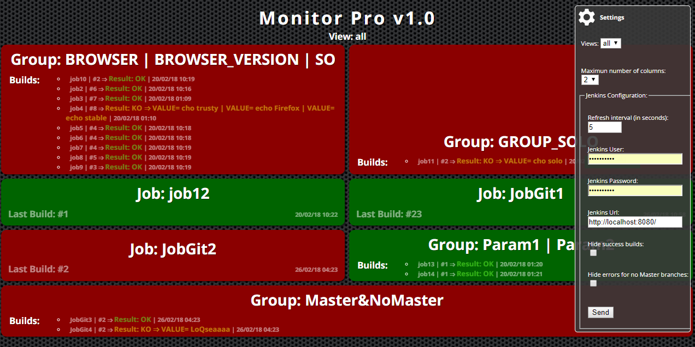
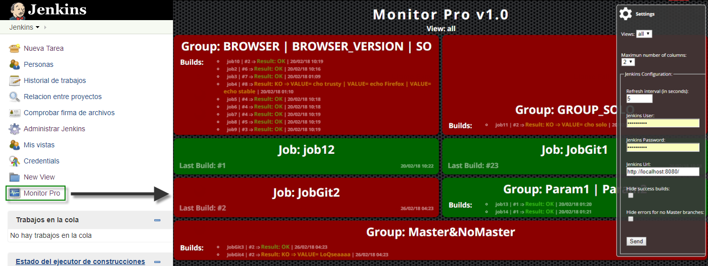

# Monitor Pro Plugin for Jenkins
  Monitor Pro Plugin, is a plugin to monitoring the status of the Jobs of a selected view, built as an Angular SPA. It provides to Jenkins interface of a button at the main screen to access the Monitor Pro application, wich will open in the same window.
    
# Features
  In this version you can:
  - Select a view.
  - Config the grid maximun number of columns.
  - Set polling interval in seconds.
  - If exist Jobs cofigured as a group in Jenkins, that jobs will be shows as a single element in the grid.
  - Config the credentials and URL of the Jenkins Server that you want monitorize.
  
  
# Installation
You can use this application as a plugin of Jenkins or integrated into any web application. Install application as a plugin there is no mistery, but if you want to use it into a web app, click on the link https://github.com/franciscoRdiaz/monitor-pro-spa to more information.

# Quick Start
  Once the plugin's installation has finished, go to the Jenkins main page. An icon has been added at bottom of the left menu. To access the monitor plugin you must click on it.
  
  

By default, Monitor Pro tries to connect to Jenkins at http://localhost:8080/jenkins, if we have cofigurated Jenkins on another port or basepath, we need to set the correct value in the configuration menu. Rememmber that Monitor Pro runs on Jenkis,  so it is not to set any user or password. You only need to fill in these filds if you run Monitor Pro on another web application or if you want monitoring another jenkins server.

# Technology
  The interface and logic of Monitor Pro, are built entirely with the Angular Framework and TypeScript. Jelly, Stapler or Java, are only used to integrate the application as a plugin on jenkins. Monitor Pro obtains job status information by making requests to the Jenkins REST API..
    
# Based on
  To Start building this plugin, we have taken two reference:
- Jenkins EzWall Plugin
- Jenkins CI Build Monitor Plugin

# Licence
The MIT License (MIT)
Copyright (c) 2016 Francisco R Díaz

Permission is hereby granted, free of charge, to any person obtaining a copy of this software and associated documentation files (the "Software"), to deal in the Software without restriction, including without limitation the rights to use, copy, modify, merge, publish, distribute, sublicense, and/or sell copies of the Software, and to permit persons to whom the Software is furnished to do so, subject to the following conditions:

The above copyright notice and this permission notice shall be included in all copies or substantial portions of the Software.

THE SOFTWARE IS PROVIDED "AS IS", WITHOUT WARRANTY OF ANY KIND, EXPRESS OR IMPLIED, INCLUDING BUT NOT LIMITED TO THE WARRANTIES OF MERCHANTABILITY, FITNESS FOR A PARTICULAR PURPOSE AND NONINFRINGEMENT. IN NO EVENT SHALL THE AUTHORS OR COPYRIGHT HOLDERS BE LIABLE FOR ANY CLAIM, DAMAGES OR OTHER LIABILITY, WHETHER IN AN ACTION OF CONTRACT, TORT OR OTHERWISE, ARISING FROM, OUT OF OR IN CONNECTION WITH THE SOFTWARE OR THE USE OR OTHER DEALINGS IN THE SOFTWARE.
